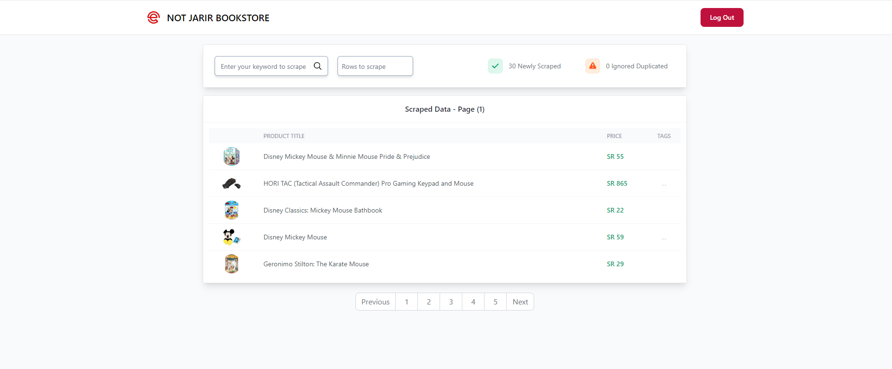

# Proxidize Frontend

The frontend was built using vue JS (composition API) styled using tailwindcss, utilizing routers & Pinia for global state management.

Running @ [NotJarir](https://proxidize-scraper.netlify.app/#/)

